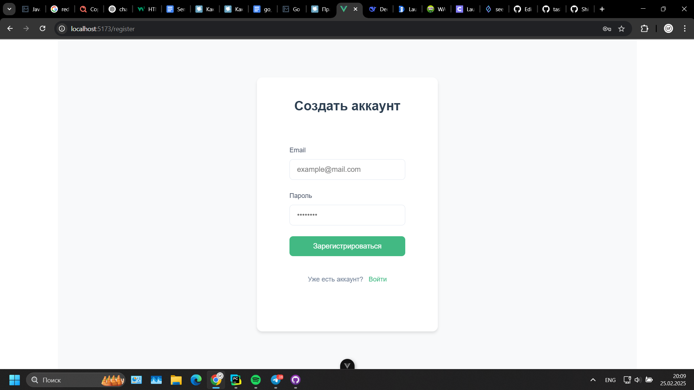
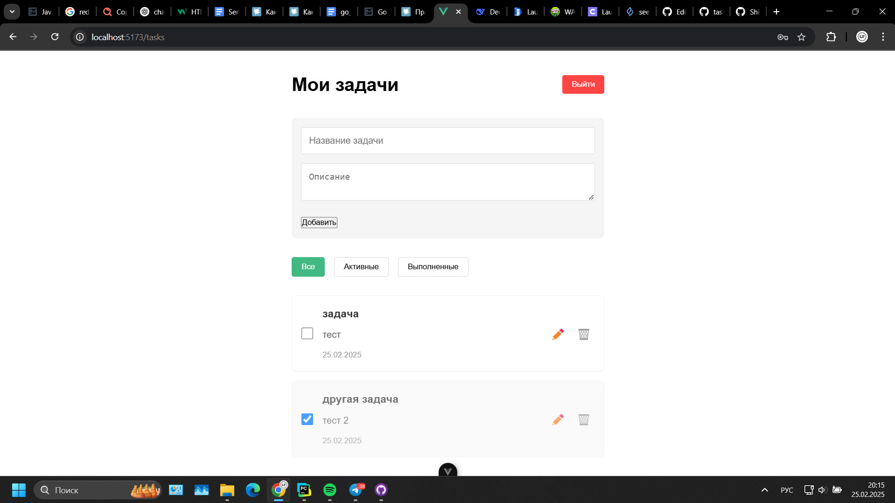
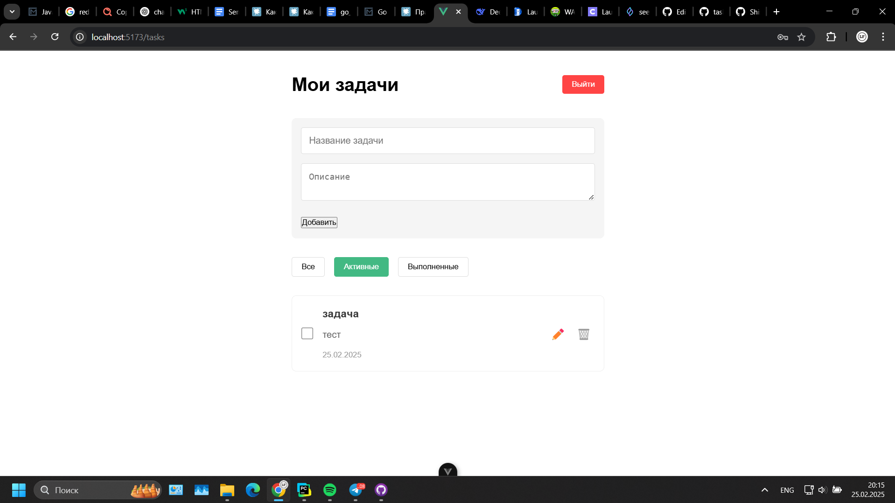
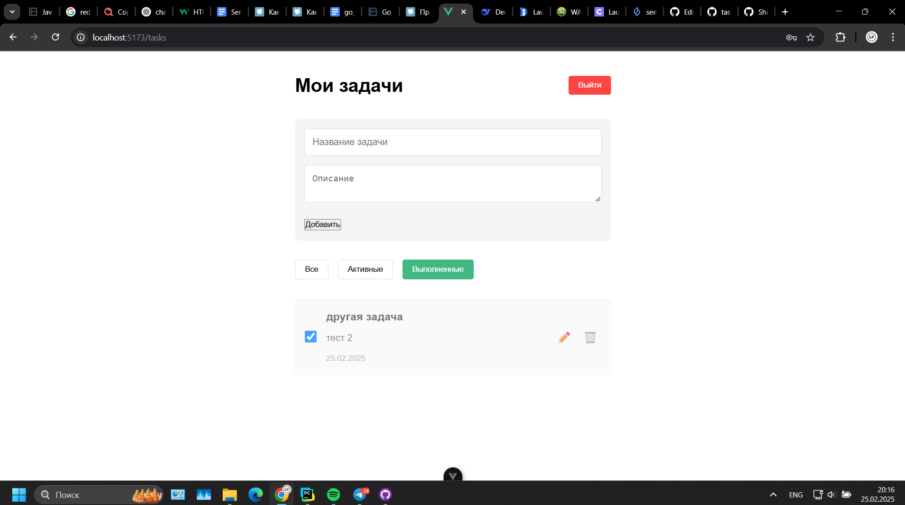
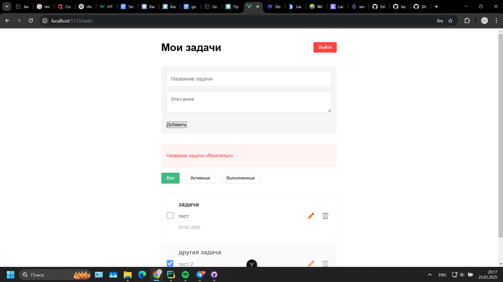
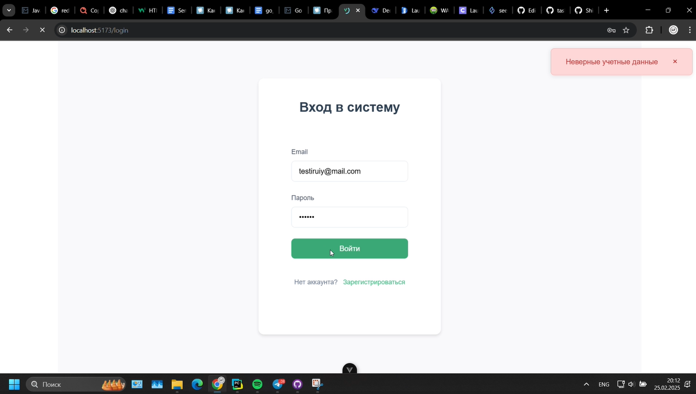
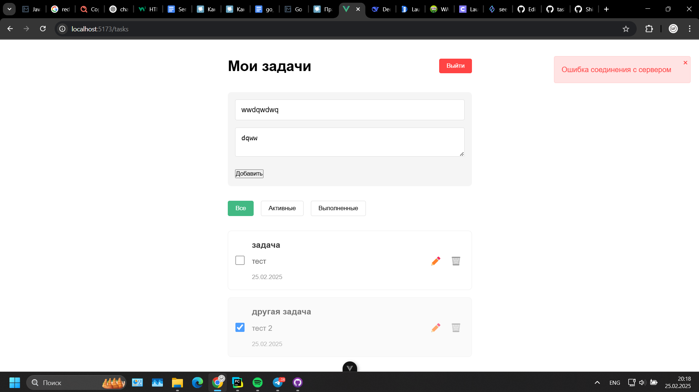

# taskManager
Тестовое задание веб-приложение “Список задач”
## Оглавление
- [Реализованные функции](#список-реализованных-фич)  
   - [Backend](#backend)  
   - [Frontend](#frontend)  
   - [Дополнительно](#дополнительно)  
- [Установка и запуск](#инструкции-по-установку-и-запуску)  
- [Скриншоты приложения](#превью)  
   - [Страница входа](#страница-входа)  
   - [Страница регистрации](#страница-регистрации)  
   - [Интерфейс задач](#страница-задач)  
   - [Обработка ошибок](#примеры-обработки-ошибок)

## Список реализованных фич
### Backend
- REST API на Flask
- регистрация, аутентификация
- JWT-токен с лимитом по времени
- CRUD-операции для задач
### Frontend
- Приложение на Vue
- Форма регистрации и логина
- Добавление, удаление, редактирование задач, изменение статуса и фильтрация по нему
-  Обработка ошибок от API и отображение сообщений для пользователя
-  Защита маршрутов и проверка наличия JWT-токена
### Дополнительно
- Приложение и api были реализованы на асинхронной структуре
- Тесты для api

## Инструкции по установку и запуску
- установите и запустите бекенд: [Backend instruction](backend/README.md)
- установите и запустите фронтенд: [Frontend instruction](frontend/vue-project/README.md)

## Превью
### Страница входа

### Страница регистрации

### Страница задач

### Примеры обработки ошибок

